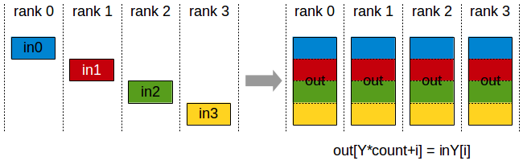

*********************
Collective Operations
*********************

Collective operations have to be called for each rank (hence CUDA device) to form a complete collective operation. Failure to do so will result in other ranks waiting indefinitely.

.. _allreduce:

AllReduce
---------

The AllReduce operation is performing reductions on data (for example, sum, min, max) across devices and writing the result in the receive buffers of every rank.

In an allreduce operation between k ranks and performing a sum, each rank will provide an array Vk of N values, and receive an identical arrays S of N values,
where S[i] = V0[i]+V1[i]+...+Vk-1[i].

.. figure:: images/allreduce.png
 :align: center
 
 All-Reduce operation: each rank receives the reduction of input values across ranks.

Related links: :c:func:`ncclAllReduce`.

.. _broadcast:

Broadcast
---------

The Broadcast operation copies an N-element buffer on the root rank to all ranks.

.. figure:: images/broadcast.png
 :align: center
 
 Broadcast operation: all ranks receive data from a 鈥渞oot鈥� rank. 

Important note: The root argument is one of the ranks, not a device number, and is therefore impacted by a different rank to device mapping.

Related links: :c:func:`ncclBroadcast`.

.. _reduce:

Reduce
------

The Reduce operation is performing the same operation as AllReduce, but writes the result only in the receive buffers of a specified root rank.

.. figure:: images/reduce.png
 :align: center
 
 Reduce operation : one rank receives the reduction of input values across ranks.

Important note : The root argument is one of the ranks (not a device number), and is therefore impacted by a different rank to device mapping.

Note: A Reduce, followed by a Broadcast, is equivalent to the AllReduce operation.

Related links: :c:func:`ncclReduce`.

.. _allgather:

AllGather
---------

The AllGather operation gathers N values from k ranks into an output of size k*N, and distributes that result to all ranks.

The output is ordered by rank index. The AllGather operation is therefore impacted by a different rank or device mapping.

 
 AllGather operation: each rank receives the aggregation of data from all ranks in the order of the ranks. 

Note: Executing ReduceScatter, followed by AllGather, is equivalent to the AllReduce operation.

Related links: :c:func:`ncclAllGather`.

.. _reducescatter:

ReduceScatter
-------------

The ReduceScatter operation performs the same operation as the Reduce operation, except the result is scattered in equal blocks between ranks,
each rank getting a chunk of data based on its rank index.

The ReduceScatter operation is impacted by a different rank or device mapping since the ranks determine the data layout.

.. figure:: images/reducescatter.png
 :align: center

 Reduce-Scatter operation: input values are reduced across ranks, with each rank receiving a subpart of the result.

Related links: :c:func:`ncclReduceScatter`